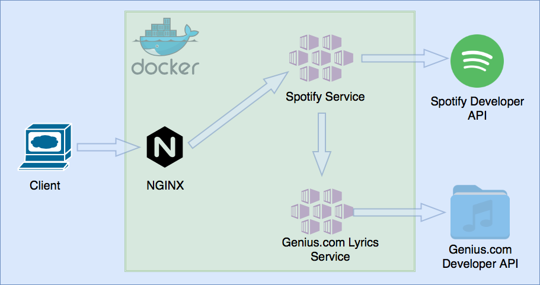

# Spotify Profile Analyzer

## Developer notes -
I created this project with the goal of getting more experience working with the following technologies -
* Docker
* Docker-compose
* Go
* GRPC
* NGINX
* Third party restful APIs
* Micro-Service architectures

because of this goal when considering system design I tried to maximize my exposure to those technologies.  In practice
for the expected small audiance this would be a poor design.  The system would probably be better served by a small monolithic application.

## Setting up the developement environment and running services
Developement dependences -
* Docker https://docs.docker.com/install/
* Golang 1.13 https://golang.org/doc/install
* protobuf compiler 3.9.1 https://grpc.io/docs/quickstart/go/

1. First download the required dependenies and cloning this github repo.
2. You need to set the necessary enironment variables for the docker-compose.yaml file to use
3. Next in the SpotifyAnalyzer directoryn run "Docker-Compose build".  This will build the necessary docker images.
4. After building the images you can run "Docker-Compose up" to start up the environment.

## System design diagram
Below is a diagram of the system which is created when "docker-compose up" is run from the SpotifyAnalyzer directory
